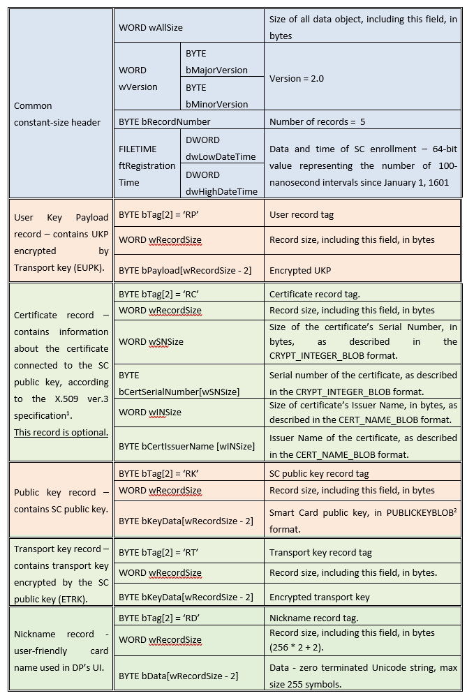

###### [DigitalPersona Access Management API ](https://hidglobal.github.io/digitalpersona-access-management-api/)/ DigitalPersona Access Management Services / Smart Card Data Format  &nbsp;&nbsp;&nbsp;&nbsp;&nbsp;&nbsp;[\| View Repo \|](https://github.com/hidglobal/access-management-services)  

## Smart Card Data Format  

This topic describes the data format used with Smart Card enrollment.  

The table below shows the data blob used with the SC Authentication Provider. The data has a variable size, so it is created as a fixed-size header followed by a set of tagged records. Data in the blob is stored in a little-endian format.  

bRecordNumber is the number of tagged records, 5 records in ver. 2.0.  

Version 2.0 defines five valid record tags. They are:

- RP – Payload record  
-	RC – Certificate record						
- RK – Public key record  
- RT – Transport key record
- RD – Card nickname record.

